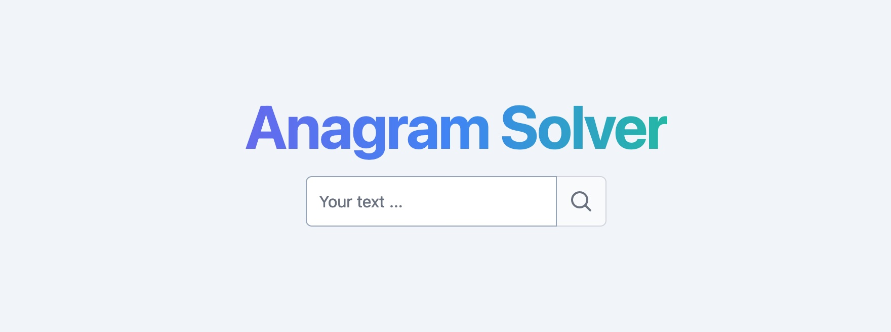

<a href="https://anagram-delta.vercel.app/">
  
  <h1 align="center">Anagram slover</h1>
</a>

---

A simple full stack anagram solver built with [Next.js](https://nextjs.org/) that helps users find all possible anagrams for a given word or phrase.

## Getting Started
### 1. Locally:

These instructions will get you a copy of the project up and running on your local machine for development and testing purposes.

1. Clone the repository:
```bash
# HTTPS
git clone https://github.com/Tittoh/anagram-solver.git
# or CLI
gh repo clone Tittoh/anagram-solver
```

2. Install the dependencies: `yarn install`

3. Start the development server: `yarn dev`

4. Open http://localhost:3000 in your browser to view the application.

First, run the development server:


You can start editing the page by modifying `src/pages/index.tsx`.

[API routes](https://nextjs.org/docs/api-routes/introduction) can be accessed on [http://localhost:3000/api/anagram](http://localhost:3000/api/anagram). This endpoint can be edited in `src/pages/api/anagram.ts`.

### 2. One-click Deploy
You can deploy this template to Vercel with the button below:

[](https://vercel.com/new/clone?repository-url=https%3A%2F%2Fgithub.com%2FTittoh%2Fanagram-solver)
## Usage

1. Enter a word or phrase in the input field.

2. Click the "Search" button.

3. All possible anagrams will be displayed below the input field.

## Technologies
- [Next.js](https://nextjs.org/) – React framework for building performant apps with the best developer experience
- [Tailwind CSS](https://tailwindcss.com/) – Utility-first CSS framework for rapid UI development
- [Vercel](https://vercel.com/) – Easily preview & deploy changes with git
## Contribution

To contribute to the project, please follow these guidelines:

1. Fork the repository.

2. Create a new branch for your feature or bug fix.

3. Send a pull request.

## Known Issues
- The available dictionary is contains ~23,000 words.
If you find any issues, please report them [here](https://github.com/Tittoh/anagram-solver/issues).

## License

This project is licensed under the MIT License - see the [LICENSE.md](LICENSE.md) file for details.

## Author

- **Titus K.** - [Tittoh](https://github.com/Tittoh)
